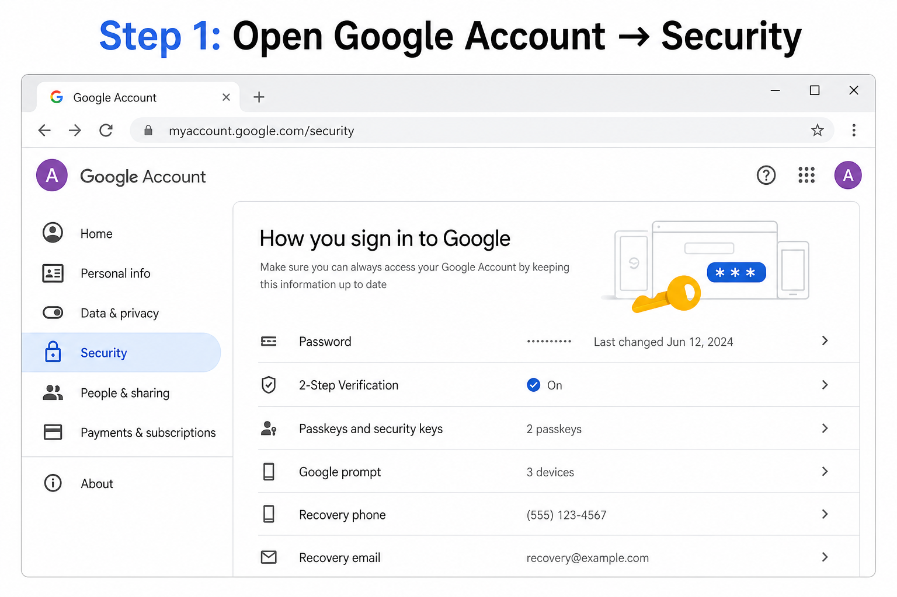
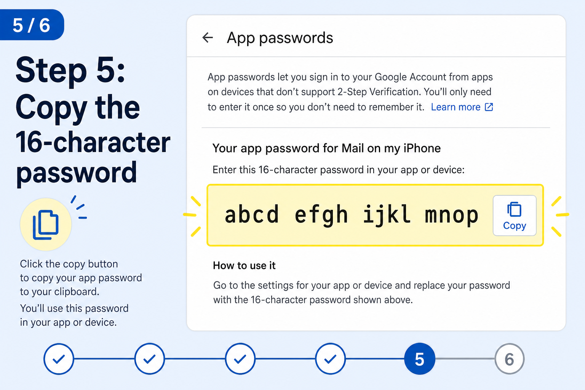

# Resume Blaster — Free Bulk Resume Email Sender

🌐 **Live site:** [https://rushabh023.github.io/resume-blaster/](https://rushabh023.github.io/resume-blaster/)

Send your resume to multiple HR emails in one click. **100% free.** No paid APIs. No subscriptions.

Each person runs it on **their own computer** with **their own Gmail** — your password never leaves your PC.

---

## Quick Start (3 steps)

### 1. Download & install Python

- Download this project (ZIP from GitHub Releases, or clone the repo)
- Install [Python 3](https://www.python.org/downloads/) — check **"Add Python to PATH"**

### 2. Create Gmail App Password (one time)

**📖 [Open Setup Guide with photos →](setup-guide.html)**

Or follow these 6 steps:

| Step | Action |
|------|--------|
| 1 | Go to [myaccount.google.com/security](https://myaccount.google.com/security) |
| 2 | Turn **ON** 2-Step Verification |
| 3 | Search **App passwords** |
| 4 | Create password: App = **Mail**, Device = **Resume Blaster** |
| 5 | Copy the **16-character** password |
| 6 | Paste in the app → Step 4 |





> **Full visual guide with all 6 photos:** open `setup-guide.html` in your browser.

### 3. Run & send

1. **Double-click `start.bat`** (Windows) — keep the window open
2. Open **http://localhost:8765**
3. Upload PDF resume → write email → paste HR emails
4. Enter Gmail + App Password in Step 4
5. Click **🚀 Send to All**

---

## How it works

```
You → Browser (localhost:8765) → Python server (your PC) → Gmail → HR inboxes
```

- Resume PDF stays on your computer until sent
- No cloud hosting of your data
- Free Gmail SMTP via App Password

---

## File structure

```
resume-blaster/
├── start.bat           # Double-click to start (Windows)
├── setup-guide.html    # Gmail App Password guide (with photos)
├── index.html          # The app
├── server.py           # Local server for one-click send
├── send_emails.py      # CLI backup (optional)
├── docs/images/        # Setup guide screenshots
└── README.md
```

---

## Troubleshooting

| Problem | Solution |
|---------|----------|
| `localhost refused to connect` | Run `start.bat` first, keep window open |
| `python not found` | Install Python, or run `py server.py` |
| Authentication failed | Use **App Password**, not normal Gmail password |
| Server offline (red) | Double-click `start.bat` |

---

## Gmail limits

| Account | Limit |
|---------|-------|
| Personal @gmail.com | 500 emails/day |
| Google Workspace | 2,000 emails/day |

Use **5 second delay** between sends to avoid spam blocks.

---

## Security

- Never commit or share `config.json` (contains App Password)
- Never upload your App Password to any website
- Each user creates their own App Password

---

## For developers: publish to GitHub

See **[PUBLISH.md](PUBLISH.md)** for step-by-step instructions to share this with everyone for free.

---

## License

Free to use for personal job searching. Good luck! 🚀
